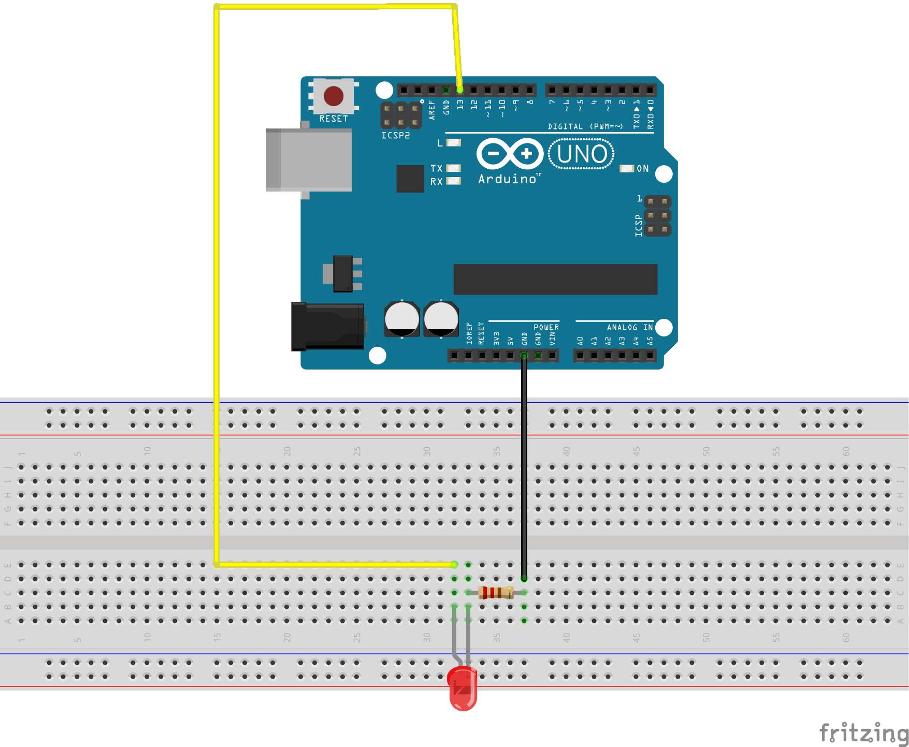

# Arduino LED Blink Tutorial using `delay()` and `millis()` function

Welcome to the Arduino LED Blink Tutorial! This guide will show you how to blink an LED on an Arduino using both the `delay()` function and a non-blocking approach with `millis()`.
We will also cover how to handle the overflow of the `millis()` function.

## Table of Contents
1. [Introduction](#introduction)
2. [Components Needed](#components-needed)
3. [Circuit Diagram](#circuit-diagram)
4. [Basic LED Blink with `delay()`](#basic-led-blink-with-delay)
5. [Non-blocking LED Blink with `millis()`](#non-blocking-led-blink-with-millis)
6. [Handling `millis()` Overflow](#handling-millis-overflow)
7. [Using a Custom Delay Function](#using-a-custom-delay-function)
8. [Bitwise Operations](#bitwise-operations)
9. [Conclusion](#conclusion)

## Introduction

Blinking an LED is one of the most fundamental tasks you can do with an Arduino. It serves as an excellent introduction to the world of microcontrollers and embedded programming.

## Components Needed

- Arduino Uno (or any other Arduino board)
- LED
- Resistor (220Ω)
- Breadboard
- Jumper wires

## Circuit Diagram



## Basic LED Blink with `delay()`

Here's a simple example of blinking an LED using the `delay()` function. This method is straightforward but not suitable for more complex tasks where you need the microcontroller to perform other operations while waiting.

### Code

Create a file named `led_blink.ino` in the `code` directory with the following content:

```cpp
void setup() {
  DDRB = B00100000; // Set pin 13 as output
}

void loop() {
  PORTB |= B00100000; // Set pin 13 high
  delay(1000);        // Wait for 1 second
  PORTB &= ~B00100000; // Set pin 13 low
  delay(1000);        // Wait for 1 second
}
```

### Explanation

- **setup()**: This function runs once when the Arduino is powered on or reset. It sets pin 13 as an output.
- **loop()**: This function runs repeatedly. It turns the LED on, waits for 1 second, turns it off, and waits for another second.

## Non-blocking LED Blink with `millis()`

To make the LED blink without blocking the microcontroller, we use the `millis()` function to track elapsed time.

### Code

Create a file named `led_blink_non_blocking.ino` in the `code` directory with the following content:

```cpp
unsigned long previousMillis = 0;  // Stores the last time the LED was updated
const long interval = 1000;        // Interval at which to blink (milliseconds)

void setup() {
  DDRB = B00100000; // Set pin 13 as output
}

void loop() {
  unsigned long currentMillis = millis();

  if (currentMillis - previousMillis >= interval) {
    // Save the last time you blinked the LED
    previousMillis = currentMillis;

    // If the LED is off, turn it on and vice-versa
    PORTB ^= B00100000; // Toggle pin 13
  }
}
```

### Explanation

- **setup()**: Sets pin 13 as an output.
- **loop()**: Uses `millis()` to check the elapsed time. If the interval has passed, it toggles the LED and updates the `previousMillis` variable.

## Handling `millis()` Overflow

The `millis()` function will overflow after approximately 50 days. However, the subtraction operation in the non-blocking code handles this overflow gracefully due to the properties of unsigned arithmetic in C/C++.

### Explanation

1. **Overflow Handling**:
   - When `millis()` overflows, it wraps around to zero. The subtraction operation `currentMillis - previousMillis` results in a large positive number due to unsigned arithmetic, which will still correctly compare against the interval.

2. **Non-blocking Timing**:
   - The logic remains the same as before, ensuring that the code does not block and allowing the microcontroller to perform other tasks.

## Using a Custom Delay Function

Here's an example of creating a custom delay function using `millis()` to simulate the behavior of the `delay()` function but in a non-blocking manner.

### Code

Create a file named `led_blink_custom_delay.ino` in the `code` directory with the following content:

```cpp
void customDelay(unsigned long duration) {
  unsigned long start = millis();
  while (millis() - start < duration) {
    // Do nothing, just wait
  }
}

void setup() {
  DDRB = B00100000; // Set pin 13 as output
}

void loop() {
  // Turn on the LED
  PORTB |= B00100000; // Set pin 13 high
  customDelay(2000);  // Wait for 2 seconds

  // Turn off the LED
  PORTB &= ~B00100000; // Set pin 13 low
  customDelay(1000);   // Wait for 1 second
}
```

### Explanation

- **customDelay()**: This function creates a blocking delay using `millis()`. It records the start time and loops until the specified duration has passed.
- **setup()**: Sets pin 13 as an output.
- **loop()**: Turns the LED on for 2 seconds using `customDelay`, then turns it off for 1 second using `customDelay`.

## Bitwise Operations

In the provided examples, we use bitwise operations to directly manipulate the microcontroller's port registers. Here’s a brief explanation of the bitwise operations used:

- **`PORTB |= B00100000`**: This is a bitwise OR operation. It sets the 6th bit of `PORTB` to 1 (turning on the LED connected to pin 13) while leaving the other bits unchanged.
- **`PORTB &= ~B00100000`**: This is a bitwise AND operation combined with a NOT operation. It sets the 6th bit of `PORTB` to 0 (turning off the LED connected to pin 13) while leaving the other bits unchanged.
- **`PORTB ^= B00100000`**: This is a bitwise XOR operation. It toggles the 6th bit of `PORTB` (if the bit is 1, it becomes 0, and if it is 0, it becomes 1).

These operations allow efficient control of individual bits in the register, which is crucial for low-level hardware manipulation.

## Conclusion

By using the `millis()` function, you can create non-blocking code that allows your Arduino to perform multiple tasks simultaneously. Handling the overflow of `millis()` ensures your code remains robust even after running for extended periods. The custom delay function demonstrates how you can create delays without blocking the main loop, providing more flexibility in your code.

## Resources

- [Arduino Reference - millis()](https://www.arduino.cc/reference/en/language/functions/time/millis/)
- [Arduino Reference - delay()](https://www.arduino.cc/reference/en/language/functions/time/delay/)
